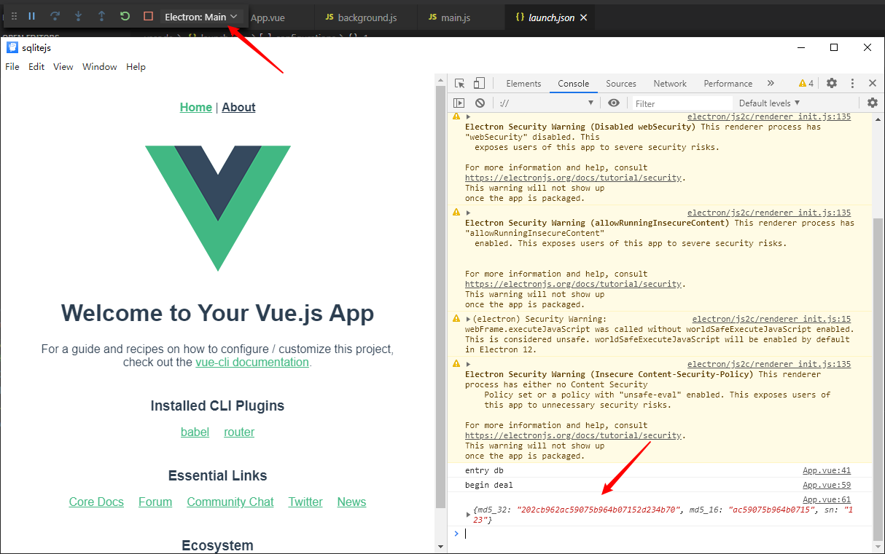
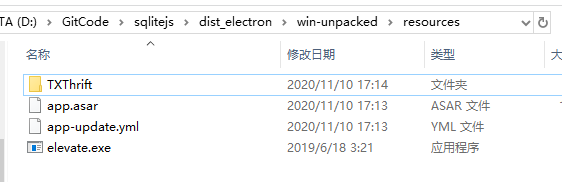

# Electron Vue Sqlite.js 

## Project setup
```
yarn install
```

## Project create

```sh
vue create sqlitejs
```

### install electron

```sh
vue add electron-builder
```

### Compiles and hot-reloads for development

```sh
yarn electron:serve
```

### install sqlite3 

```sh
yarn add sqlite3
# option aws-sdk
yarn add aws-sdk
```

## Config & Debug Electron

1. [debugging-with-vscode](https://nklayman.github.io/vue-cli-plugin-electron-builder/guide/recipes.html#debugging-with-vscode)
1. yarn electron:serve
1. go to vscode -> run start debugging  -> electron: main
1. 


### Compiles and minifies for production

```
yarn build
```

### Customize configuration

See [Configuration Reference](https://cli.vuejs.org/config/).

### Use Electron-Builder build package 

```sh
yarn electron:build
this TXThrift folder display root dir
put TXThrift folder to root dir resources folder
use nsis package
```
1. 
